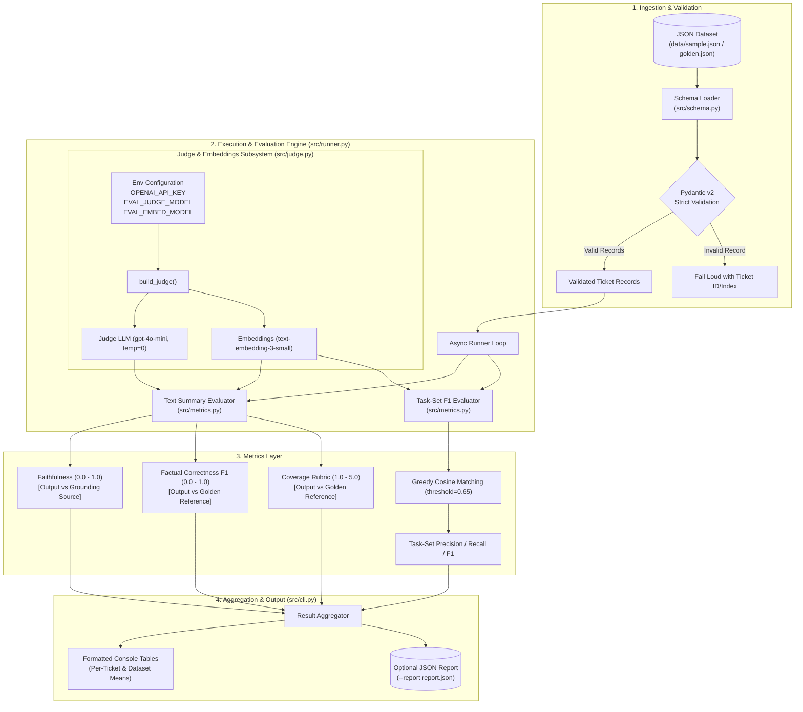
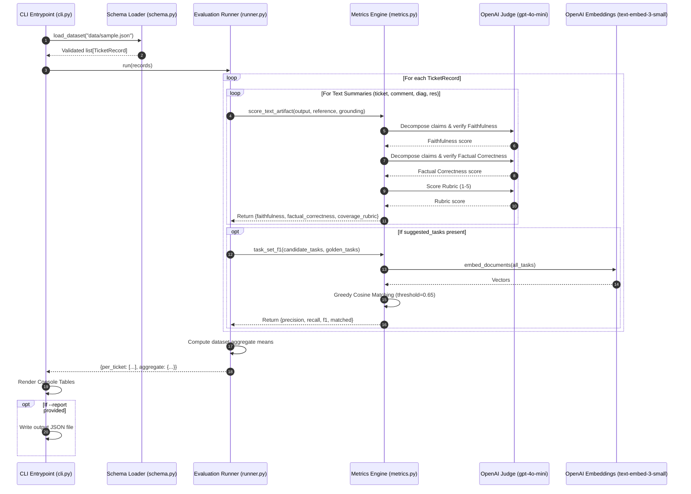

# Architecture & Technical Design Document

## ITSM AI Evaluation Framework

---

## 1. Executive Summary & Objective

The **ITSM AI Evaluation Framework** is a modular evaluation system designed to assess the quality, accuracy, grounding, and completeness of Large Language Model (LLM) outputs generated within an IT Service Management (ITSM) application.

The framework benchmarks AI-generated incident artifacts against human-verified ground truth (golden references) and source inputs using a blend of **LLM-as-a-Judge metrics (via RAGAS)** and **embedding-based semantic matching (custom Vector F1)**.

---

## 2. High-Level System Architecture



---

## 3. Core Architectural Principles

1. **Tripartite Data Separation**:
   Every evaluatable unit is partitioned into three distinct representations:
   - **`source`**: The raw context available to the generation model (e.g., ticket description, comments, diagnostics).
   - **`references`**: Human-curated, verified golden standard (the benchmark answer).
   - **`output`**: Candidate content produced by the AI model under evaluation.
   *(The framework never assumes candidate and golden references are syntactically equal).*

2. **Fault-Isolated Execution**:
   Each evaluation metric call is isolated within individual try-catch boundaries. If a single metric call fails or times out for a specific ticket, that metric records an error string while the remaining metrics and tickets continue processing uninterrupted.

3. **Pluggable & Zero-Secret Model Abstraction**:
   All model bindings are encapsulated in `src/judge.py`. No credentials are hard-coded; the judge subsystem resolves keys strictly from the runtime environment (`OPENAI_API_KEY`). Model configurations can be overridden dynamically via environment variables without codebase modifications.

4. **Async-Driven Throughput**:
   RAGAS metric evaluations are asynchronously dispatched via Python's `asyncio` event loop to allow concurrent claim-level decomposition and verification against the LLM judge.

---

## 4. Component Breakdown & Module Responsibilities

```
AI_Evaluation/
├── requirements.txt       # Strict version-pinned dependencies
├── smoke_test.py          # Pre-flight environment & model healthcheck
├── data/
│   ├── sample.json        # Test fixture (2 mock records)
│   └── golden.json        # Production golden dataset (10-20 verified tickets)
└── src/
    ├── __init__.py        # Package interface
    ├── schema.py          # Data contract, Pydantic models, grounding map
    ├── judge.py           # Model provider wrappers (LLM & Embeddings)
    ├── metrics.py         # RAGAS metric configurations & custom Vector F1
    ├── runner.py          # Evaluation loop, async driver & aggregation
    └── cli.py             # CLI parser, console table formatter, JSON exporter
```

### 4.1. Data Ingestion & Contract (`src/schema.py`)
- **Pydantic Models**:
  - `Source`: Raw incident payload (`description`, `comments`, `diagnostics`).
  - `Artifacts`: Common schema for `references` and `output` containing:
    - `ticket_summary` (Optional[str])
    - `comment_summary` (Optional[str])
    - `diagnostics_summary` (Optional[str])
    - `resolution_summary` (Optional[str])
    - `suggested_tasks` (Optional[list[str]])
  - `TicketRecord`: Root container binding `ticket_id`, `category`, `priority`, `source`, `references`, and `output`.
- **Validation Philosophy**:
  `load_dataset(path)` validates the entire dataset on load. Any malformed structure immediately raises a `ValueError` detailing the exact record index and `ticket_id`, ensuring bad data is identified before LLM API calls are executed.
- **Grounding Source Matrix**:
  | Artifact Name | Grounding Source Field | Aggregation / Transform |
  |---|---|---|
  | `ticket_summary` | `source.description` | Direct string |
  | `comment_summary` | `source.comments` | Newline concatenation (`\n`.join) |
  | `diagnostics_summary` | `source.diagnostics` | Direct string |
  | `resolution_summary` | `source.comments` | Newline concatenation (`\n`.join) |
  | `suggested_tasks` | `references.suggested_tasks` | Evaluated against golden tasks list |

---

### 4.2. Judge & Embeddings Subsystem (`src/judge.py`)
- Bridges LangChain provider objects to RAGAS 0.2.x wrapper protocols:
  - `LangchainLLMWrapper(ChatOpenAI(model=JUDGE_MODEL, temperature=0))`
  - `LangchainEmbeddingsWrapper(OpenAIEmbeddings(model=EMBED_MODEL))`
  - `OpenAIEmbeddings`: Direct raw embeddings client for vector mathematics in task-set F1.
- **Default Models**:
  - Judge LLM: `gpt-4o-mini` (configurable via `EVAL_JUDGE_MODEL`)
  - Embeddings: `text-embedding-3-small` (configurable via `EVAL_EMBED_MODEL`)

---

### 4.3. Evaluation & Metrics Subsystem (`src/metrics.py`)

#### Summary Metrics (RAGAS)
1. **Faithfulness ($0.0 \rightarrow 1.0$)**:
   - **Target**: Anti-hallucination / Grounding.
   - **Method**: Evaluates `output` against `retrieved_contexts = [grounding_source]`.
   - Decomposes the candidate output into discrete atomic claims and verifies whether each claim can be logically inferred from the grounding source text.
2. **Factual Correctness ($0.0 \rightarrow 1.0$)**:
   - **Target**: Ground truth fidelity.
   - **Method**: Measures the harmonic mean (F1) of claim overlap between candidate `output` and golden `reference`.
3. **Coverage Rubric ($1.0 \rightarrow 5.0$)**:
   - **Target**: Completeness of critical incident details.
   - **Rubric Schema**:
     - **Score 1**: Misses most key facts from the reference, or contradicts it.
     - **Score 2**: Captures a minority of key facts; important omissions.
     - **Score 3**: Captures the main point but misses some supporting facts.
     - **Score 4**: Captures nearly all key facts; minor omissions only.
     - **Score 5**: Fully captures every key fact in the reference; concise and coherent.

#### Step-by-Step Resolution Tasks (Custom Semantic Task-Set F1)
Because suggested tasks represent an unordered or semi-ordered set of discrete action items, standard string matching fails to reward synonymous phrasing.

- **Algorithm**:
  1. Generate dense vector representations for all candidate tasks $C = \{c_1, c_2, \dots, c_m\}$ and golden tasks $G = \{g_1, g_2, \dots, g_n\}$ using `text-embedding-3-small`.
  2. Compute the cosine similarity matrix $S \in \mathbb{R}^{m \times n}$ where $S_{ij} = \frac{c_i \cdot g_j}{\|c_i\| \|g_j\|}$.
  3. Execute **greedy one-to-one bipartite matching**:
     - Iterating through each candidate task $c_i$, find the unassigned golden task $g_j$ with the highest similarity.
     - If $\max(S_{ij}) \ge \tau$ (where threshold $\tau = 0.65$), increment match count $M$ and mark $g_j$ as consumed.
  4. Compute metrics:
     $$\text{Precision} = \frac{M}{|C|}, \quad \text{Recall} = \frac{M}{|G|}, \quad \text{F1} = \frac{2 \cdot \text{Precision} \cdot \text{Recall}}{\text{Precision} + \text{Recall}}$$

---

### 4.4. Execution Loop & Aggregation (`src/runner.py`)
- Orchestrates asynchronous scoring across all tickets.
- Excludes missing or skipped artifacts (`null` values) from calculation without crashing.
- Computes macro-level arithmetic means per artifact and metric across the entire dataset.

---

### 4.5. Presentation & CLI Layer (`src/cli.py`)
- Provides a command-line interface accepting `--data` (required) and `--report` (optional).
- Formats terminal tables with columnar alignment.
- Serializes full evaluation artifacts, breakdown per ticket, and dataset aggregates into structured JSON when `--report` is supplied.

---

## 5. Data Flow Diagram



---

## 6. Security, Secrets & Reliability

1. **Zero Secret Footprint**:
   No credentials, API tokens, or hardcoded secrets exist within repository code. All integrations rely on standard environment variable detection (`OPENAI_API_KEY`).
2. **Pre-flight Healthchecks**:
   `smoke_test.py` validates OpenAI API reachability and model entitlement using a single-token request prior to running batch evaluation cycles.
3. **Deterministic Evaluation**:
   The judge LLM runs at `temperature=0` to maximize evaluation repeatability across consecutive evaluation runs.

---

## 7. Cost & Latency Model

| Operation | Model / Resource | Calls per Artifact | Estimated Cost per 20 Tickets (5 Artifacts) |
|---|---|---|---|
| Summary Evaluation (Faithfulness, Factual Correctness, Rubrics) | `gpt-4o-mini` | ~3–5 LLM calls per artifact | ~$0.15 – $0.40 total |
| Task-Set Semantic Matching | `text-embedding-3-small` | 1 embedding call per ticket | < $0.001 total |
| **Total Pipeline Estimate** | — | — | **< $0.50 per full 20-ticket dataset run** |

---

## 8. Extensibility & Future Scaling Roadmap

1. **Multi-Judge / Frontier Model Consensus**:
   Ability to route evaluation calls through multiple frontier judges (e.g., GPT-4o, Claude 3.5 Sonnet) and track inter-judge agreement rates (Cohen's Kappa / Fleiss' Kappa).
2. **AWS Bedrock / Cloud-Native Provider Adapters**:
   Swap out the LangChain judge wrapper with `BedrockChat` to support self-hosted or VPC-contained evaluation pipelines without changing `metrics.py` or `runner.py`.
3. **CI/CD Quality Gate**:
   Introduce exit code thresholds (e.g., `--fail-under-f1 0.80 --fail-under-faithfulness 0.85`) to gate pull requests and model prompt updates automatically.
4. **Reference-Free Production Tracing**:
   Deploy the Faithfulness metric into live inference pipelines to score production responses without requiring human golden answers.
